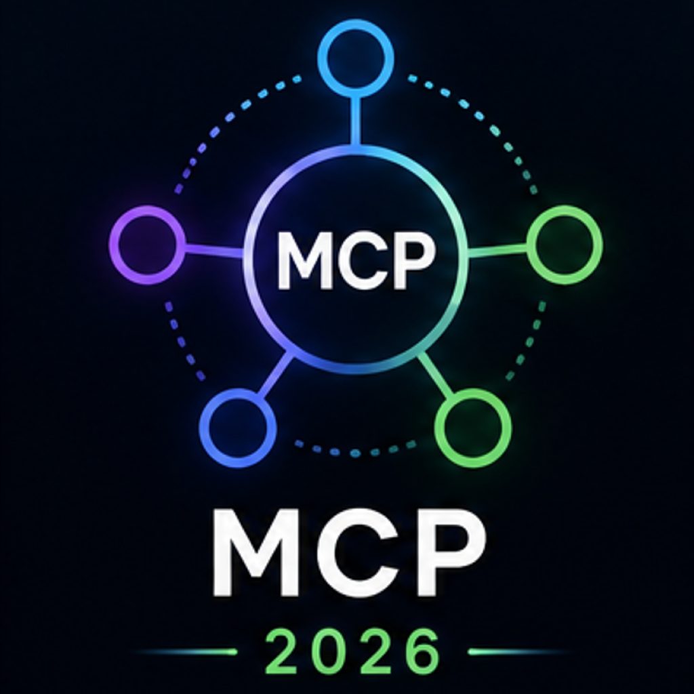

  

<h1 align="center">
Awesome MCP Servers 2026
</h1>

The largest curated collection of MCP servers for Claude, Cursor and AI Agents.

⭐ Star this repository if it helps you.

## What is MCP?

Model Context Protocol (MCP) is an open standard that allows AI assistants to securely connect with external tools, APIs, databases, file systems, and services.

## Categories

* File Systems
* Databases
* Search & Web
* Development Tools
* Productivity
* Automation
* AI & LLM
* Communication
* Cloud Services
* Miscellaneous

## Featured MCP Servers

| Server | Description |
|----------|----------|
| Filesystem MCP | Access local files and directories |
| PostgreSQL MCP | Query PostgreSQL databases |
| GitHub MCP | Repository and issue management |
| Slack MCP | Messaging and workspace automation |
| Google Drive MCP | File management and search |
| Notion MCP | Knowledge base integration |
| Web Search MCP | Internet search capabilities |
| AWS MCP | Cloud infrastructure access |

## Contributing

Contributions are welcome.

If you know an MCP server that should be included, open a pull request or issue.

## License

MIT
